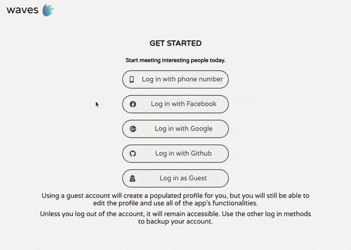
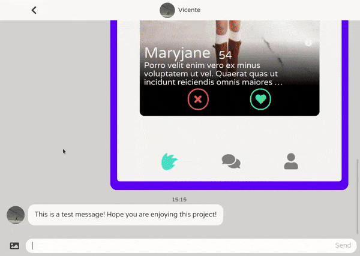
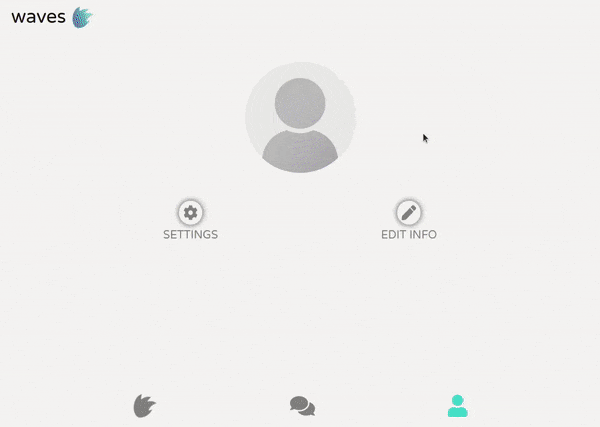
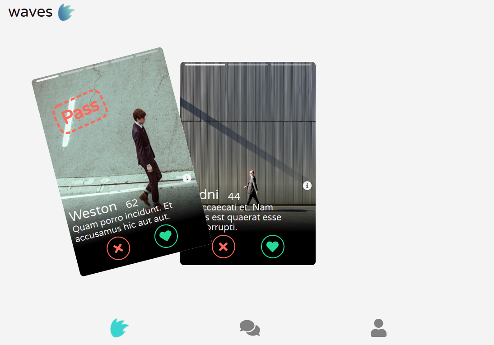
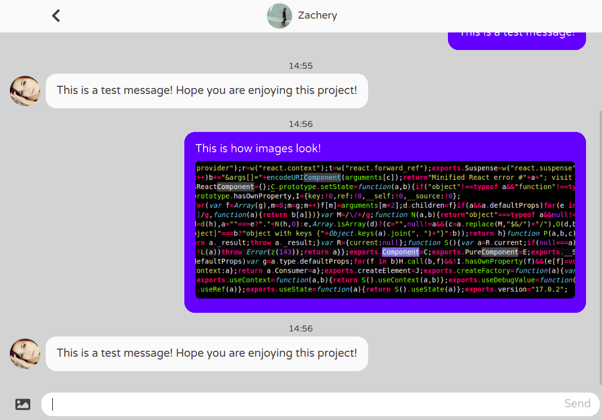
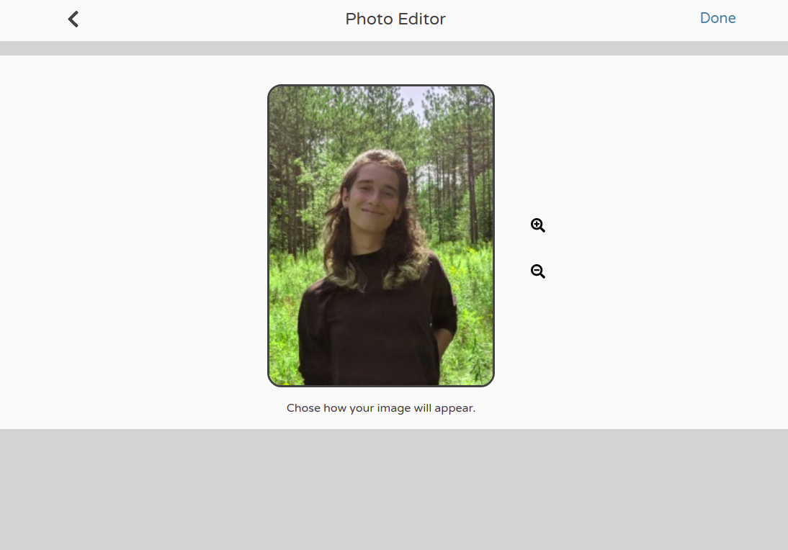
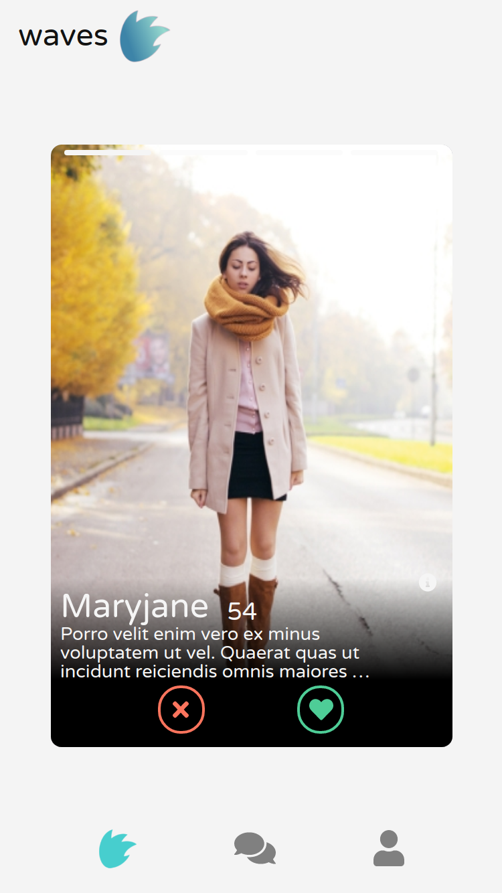
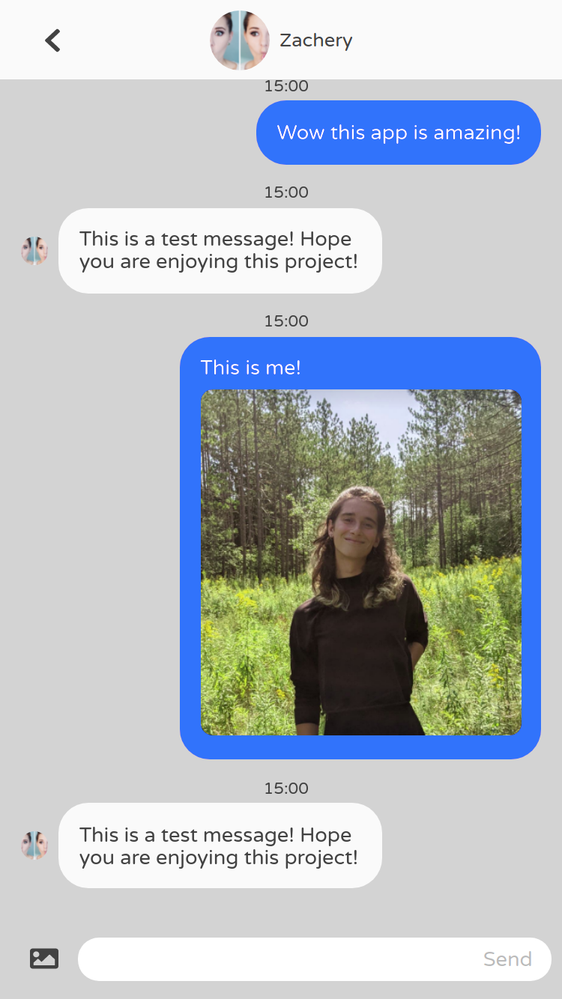

<div id="top"></div>
<h1 align="center">Waves</h1>

  <p align="center">
    A social discovery app.
    <br />
    <br />
    <a href="https://leau-void.github.io/tinder-clone">Live Demo</a>
    ·
    <a href="https://github.com/leau-void/tinder-clone/issues">Report Bug</a>
    ·
    <a href="https://github.com/leau-void/tinder-clone">Request Feature</a>
  </p>
</div>

## About The Project

##### Main demo pt.1
[](https://leau-void.github.io/tinder-clone/)

##### Main demo pt.2
[](https://leau-void.github.io/tinder-clone/)

##### Profile creation demo
[](https://leau-void.github.io/tinder-clone/)


<a href="#preview">More screenshots</a>

Waves is a social discovery app. Meet, match and chat with people in your area, or from around the globe!

## Getting started

```
git clone https://github.com/leau-void/tinder-clone.git
cd tinder-clone
npm install
npm start
```

## Features

- Live feed where you can *like* or *pass* profiles, using either buttons or swipping gestures.
- Real-time chatrooms where you can talk with your matches, sendint text and images.
- Presence of dummy accounts that automatically *like* anyone back and reply to messages to test out the functionalities.
- Edit the settings of your account and your public profile, preview your profile before saving, and crop or scale your pictures with the internal cropping tool.

## Built With

- [React](https://reactjs.org/)
- [Typescript](https://www.typescriptlang.org/)
- [Firebase Auth](https://firebase.google.com/products/auth)
- [Cloud Firestore](https://firebase.google.com/products/firestore)
- [Cloud Storage](https://firebase.google.com/products/storage)
- [styled-components](https://styled-components.com/)
- [Fontawesome](https://fontawesome.com/)
- [Faker.js for generating fake user info](https://github.com/marak/Faker.js/)
- [HTML5 Geolocation API](https://developer.mozilla.org/en-US/docs/Web/API/Geolocation_API)
- [Geolib for calculation distances from geolocation](https://www.npmjs.com/package/geolib)


## Preview

### Desktop
<div align="center">
<a href="https://leau-void.github.io/tinder-clone/"></a>
<a href="https://leau-void.github.io/tinder-clone/"></a>
<a href="https://leau-void.github.io/tinder-clone/"></a>
</div>

### Mobile 
<div align="center">
<a href="https://leau-void.github.io/tinder-clone/"></a>
<a href="https://leau-void.github.io/tinder-clone/"></a>
<a href="https://leau-void.github.io/tinder-clone/"></a>
</div>

## Contact

Leau P - [LinkedIn](https://www.linkedin.com/in/leau-p) - lpierra@gmail.com

Project Link: [https://github.com/leau-void/tinder-clone](https://github.com/leau-void/tinder-clone)

<p align="right">(<a href="#top">back to top</a>)</p>

